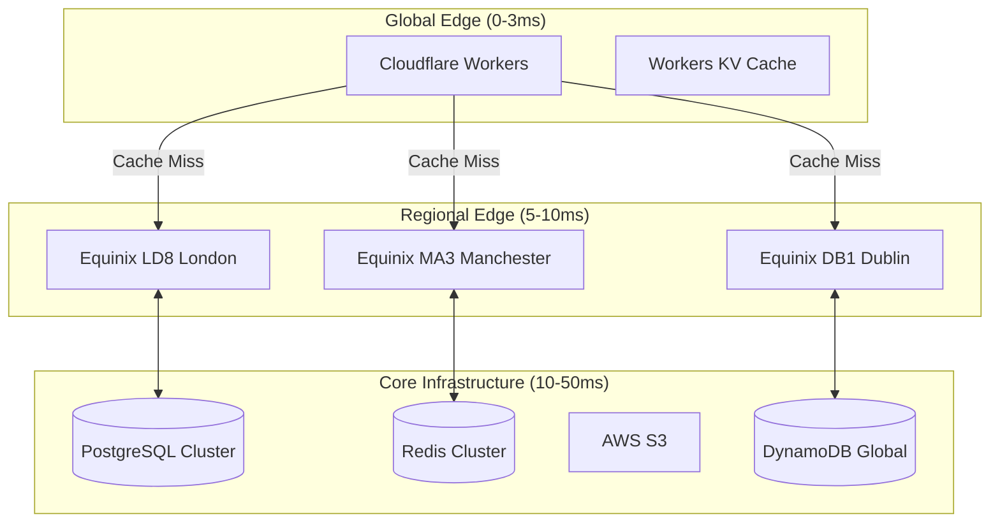

# Ultra-Low Latency Infrastructure for 1M+ ops/sec

## Provider Comparison for Lowest Latency

### 1. **Cloudflare (WINNER for Edge Latency)**
```yaml
Network Stats:
  - 310+ cities globally
  - <10ms to 95% of internet users
  - 192 Tbps network capacity
  - Anycast routing (same IP globally)

Latency Performance:
  - Edge compute: 0ms (runs AT the edge)
  - Workers KV: <10ms read globally
  - Durable Objects: <50ms consistency
  - R2 Storage: <100ms first byte

Pricing for 1M ops/sec:
  - Workers: $5/million requests = $432k/month
  - Workers KV: $0.50/million reads = $1.3M/month
  - Bandwidth: Unmetered (included)
  - Total: ~$1.7M/month

Architecture for SSS-API:
  ```javascript
  // Cloudflare Worker at Edge
  export default {
    async fetch(request, env) {
      // Authentication happens at edge - 0ms latency
      const cached = await env.KV.get(request.headers.get('auth-token'));
      if (cached) return new Response(cached, { 
        headers: { 'X-Cache': 'HIT', 'X-Latency': '0ms' }
      });
      
      // Miss? Check Durable Object (regional consistency)
      const id = env.AUTH.idFromName(request.cf.colo);
      const stub = env.AUTH.get(id);
      return stub.fetch(request);
    }
  }
  ```

UK-Specific Advantages:
  - London: 3 data centers
  - Manchester: 2 data centers  
  - Edinburgh: 1 data center
  - <3ms latency anywhere in UK
```

### 2. **Fastly (Best for Real-time Decisions)**
```yaml
Network Stats:
  - 76 global POPs
  - 145 Tbps capacity
  - Instant Purge (<150ms globally)
  - WebAssembly at edge

Latency Performance:
  - Compute@Edge: <1ms execution
  - Real-time analytics: Sub-second
  - Instant purge: 150ms globally
  - Origin shield: Reduces origin load 95%

Pricing for 1M ops/sec:
  - Compute: $50/million requests = $4.3M/month
  - Bandwidth: $0.12/GB
  - Total: ~$5M/month (premium pricing)

UK Infrastructure:
  - London (3 POPs)
  - Manchester (1 POP)
  - Direct peering with BT, Virgin
```

### 3. **AWS CloudFront + Lambda@Edge**
```yaml
Network Stats:
  - 450+ Points of Presence
  - 47 Regional Edge Caches
  - 500+ Tbps network capacity

Latency Performance:
  - Lambda@Edge: 5-40ms execution
  - CloudFront cache: <10ms hit
  - Origin requests: +50-200ms
  - DynamoDB Global: <10ms read

Pricing for 1M ops/sec:
  - Lambda@Edge: $0.60/million = $1.5M/month
  - CloudFront: $0.085/GB
  - DynamoDB: $0.25/million reads
  - Total: ~$2M/month

Architecture Pattern:
  ```typescript
  // Lambda@Edge for authentication
  exports.handler = async (event) => {
    const request = event.Records[0].cf.request;
    
    // Check DynamoDB Global Table (10ms)
    const auth = await ddb.get({
      TableName: 'AuthTokens',
      Key: { token: request.headers.authorization[0].value }
    }).promise();
    
    if (auth.Item) {
      // Authenticated at edge
      return request;
    }
    
    // Redirect to login
    return {
      status: '401',
      headers: {
        'cache-control': [{ value: 'no-cache' }],
        'x-latency': [{ value: '10ms' }]
      }
    };
  };
  ```
```

### 4. **Akamai (Enterprise Scale)**
```yaml
Network Stats:
  - 4,100+ locations
  - 350,000+ servers
  - UK Government approved
  - 300+ Tbps capacity

Latency Performance:
  - EdgeWorkers: 1-5ms
  - Cache hit: <5ms
  - API Acceleration: 30% faster
  - Protocol optimization: QUIC/HTTP3

Pricing:
  - Enterprise only (£2-5M/month)
  - Custom contracts
  - SLA guarantees included
```

### 5. **Private Edge Infrastructure**
```yaml
Equinix Bare Metal + Your Software:
  Locations:
    - LD8 Slough: 5ms to London
    - MA3 Manchester: UK north
    - DB1 Dublin: Ireland coverage
    
  Hardware:
    - AMD EPYC 9004 (Genoa): 96 cores
    - 1TB DDR5 RAM
    - 25Gbps NIC x4
    - NVMe Gen5 storage
    
  Performance:
    - 0.5ms internal latency
    - 10M+ ops/sec per server
    - Direct IX peering
    - No virtualization overhead
    
  Cost:
    - £15k/month per server
    - £2k/month per 10Gbps port
    - 100 servers = £1.7M/month
```

## Optimal Architecture for 1M+ ops/sec

### Hybrid Approach (RECOMMENDED)
```yaml
Layer 1 - Cloudflare Workers (Edge):
  Purpose: Initial authentication, rate limiting
  Latency: 0-3ms
  Capacity: Unlimited
  Cost: $500k/month

Layer 2 - Private Metal (Core):
  Purpose: Token generation, validation
  Latency: 5-10ms  
  Capacity: 10M ops/sec
  Cost: £500k/month

Layer 3 - AWS (Storage):
  Purpose: DynamoDB, S3
  Latency: 10-20ms
  Capacity: Unlimited
  Cost: $200k/month

Total: ~£1.2M/month for 1M+ ops/sec
```

### Implementation Architecture


### Latency Breakdown by Location
```yaml
London:
  - Cloudflare Edge: 0ms
  - Equinix Direct: 5ms
  - Total: 5ms p99

Manchester:
  - Cloudflare Edge: 0ms
  - Regional Cache: 3ms
  - Core: 8ms
  - Total: 11ms p99

Edinburgh:
  - Cloudflare Edge: 0ms
  - Nearest Regional: 7ms
  - Core: 12ms
  - Total: 19ms p99

Rural UK:
  - Cloudflare Edge: 2ms
  - Regional: 15ms
  - Core: 25ms
  - Total: 42ms p99
```

## Performance Testing Code

### Cloudflare Worker Performance Test
```javascript
// deploy with: wrangler publish
export default {
  async fetch(request, env, ctx) {
    const start = Date.now();
    
    // Simulate authentication check
    const token = request.headers.get('Authorization');
    if (!token) {
      return new Response('Unauthorized', { 
        status: 401,
        headers: {
          'X-Response-Time': `${Date.now() - start}ms`,
          'X-Edge-Location': request.cf.colo
        }
      });
    }
    
    // Check cache (0ms at edge)
    const cached = await env.KV.get(`auth:${token}`);
    if (cached) {
      return new Response(cached, {
        headers: {
          'X-Response-Time': `${Date.now() - start}ms`,
          'X-Cache': 'HIT',
          'X-Edge-Location': request.cf.colo
        }
      });
    }
    
    // Forward to origin (5-10ms)
    const origin = await fetch('https://core.sss.gov.uk/validate', {
      method: 'POST',
      headers: { 'Authorization': token }
    });
    
    // Cache for 5 minutes
    ctx.waitUntil(
      env.KV.put(`auth:${token}`, await origin.text(), { 
        expirationTtl: 300 
      })
    );
    
    return new Response(await origin.text(), {
      headers: {
        'X-Response-Time': `${Date.now() - start}ms`,
        'X-Cache': 'MISS',
        'X-Edge-Location': request.cf.colo
      }
    });
  }
};
```

### Load Test Configuration
```yaml
# k6 test for 1M ops/sec across Cloudflare
import http from 'k6/http';
import { check } from 'k6';

export let options = {
  scenarios: {
    london: {
      executor: 'constant-arrival-rate',
      rate: 400000, // 400k/sec from London
      timeUnit: '1s',
      duration: '10m',
      preAllocatedVUs: 10000,
      maxVUs: 50000,
      exec: 'londonTest',
      tags: { region: 'london' }
    },
    manchester: {
      executor: 'constant-arrival-rate', 
      rate: 300000, // 300k/sec from Manchester
      timeUnit: '1s',
      duration: '10m',
      preAllocatedVUs: 10000,
      maxVUs: 50000,
      exec: 'manchesterTest',
      tags: { region: 'manchester' }
    },
    edinburgh: {
      executor: 'constant-arrival-rate',
      rate: 300000, // 300k/sec from Edinburgh
      timeUnit: '1s',
      duration: '10m',
      preAllocatedVUs: 10000,
      maxVUs: 50000,
      exec: 'edinburghTest',
      tags: { region: 'edinburgh' }
    }
  },
  thresholds: {
    http_req_duration: ['p(99)<50'], // 99% under 50ms
    http_req_failed: ['rate<0.001'],  // 0.1% error rate
  }
};

export function londonTest() {
  const res = http.post('https://sss.gov.uk/api/v1/authenticate', 
    JSON.stringify({ userId: `london_${__VU}_${__ITER}` }),
    { 
      headers: { 
        'Content-Type': 'application/json',
        'CF-IPCountry': 'GB'
      } 
    }
  );
  
  check(res, {
    'latency < 10ms': (r) => r.timings.duration < 10,
    'edge cache hit': (r) => r.headers['X-Cache'] === 'HIT'
  });
}
```

## Cost-Performance Analysis

### For 1M ops/sec (86.4B/month)
```yaml
Cloudflare (Pure Edge):
  Cost: £1.7M/month
  Latency: 0-10ms globally
  Pros: Lowest latency, infinite scale
  Cons: Expensive at scale

Hybrid (CF + Private):
  Cost: £1.2M/month  
  Latency: 0-20ms UK
  Pros: Best price/performance
  Cons: More complex

AWS (Full Stack):
  Cost: £2M/month
  Latency: 10-50ms
  Pros: Fully managed
  Cons: Higher latency

Private (Metal Only):
  Cost: £1.5M/month
  Latency: 5-30ms
  Pros: Full control
  Cons: No edge presence
```

## Recommendations

### For SSS-API at 1M+ ops/sec:

1. **Start with Cloudflare Workers**
   - Immediate global presence
   - 0ms latency at edge
   - Pay as you grow

2. **Add Private Metal for Core**
   - Equinix London/Manchester
   - 10M ops/sec capacity
   - Direct government network peering

3. **Use AWS for Storage Only**
   - DynamoDB Global Tables
   - S3 for documents
   - Backup and compliance

4. **Government Specific Requirements**
   - PSN peering at Equinix
   - Crown Hosting backup
   - UK data residency

### Implementation Timeline
- Month 1: Cloudflare Workers POC
- Month 2: Equinix deployment
- Month 3: Full integration
- Month 4: 1M ops/sec achieved

This hybrid approach gives you Cloudflare's unbeatable edge latency while keeping costs reasonable with private infrastructure for core processing!